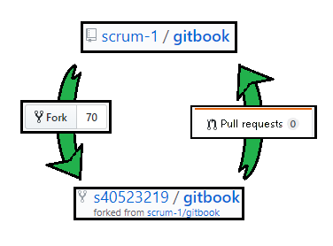
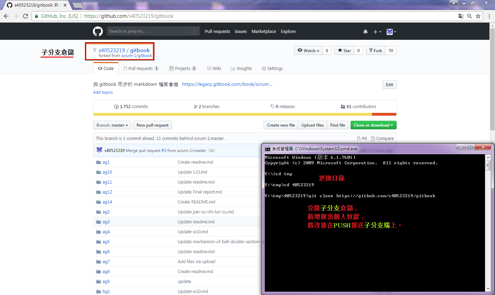
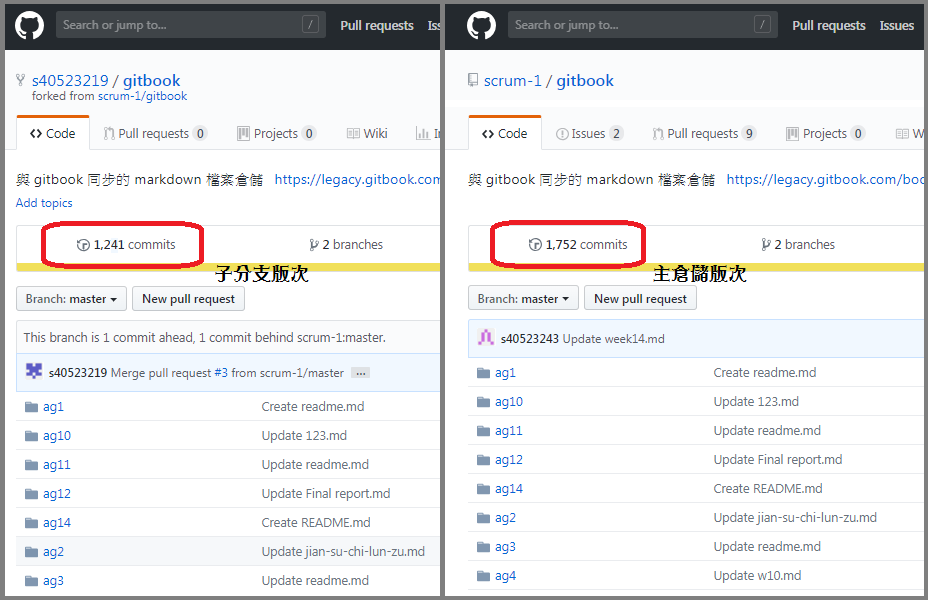
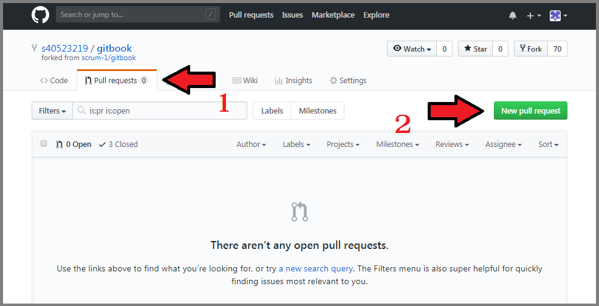
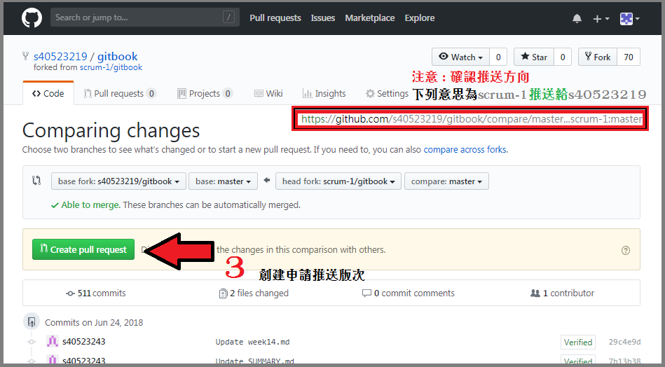
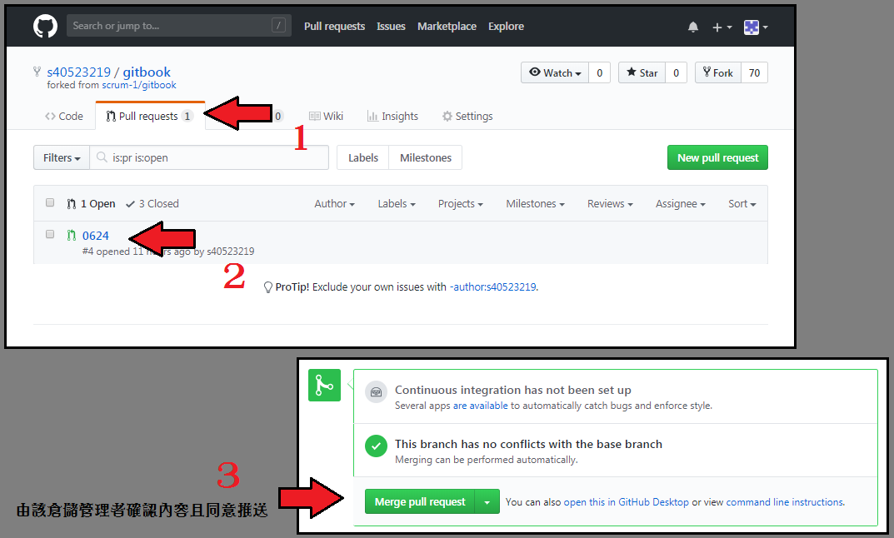
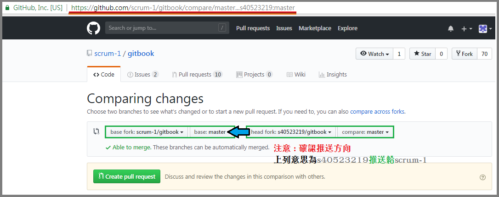

Title: Pull Requests 導入教學
Date: 2018-06-24 12:04
Category: Course
Tags: 筆記
Author: 40523219

利用 Pull Requests 的分支功能，能夠便利開發者之間的協同，如果在協同上有任何變更或者嘗試，即可利用此功能將倉儲以複製分支的方式，將其拉出進行測試及微調，測試後若無異議，即可將其回推主分支，再由管理者檢測並同意合併。

<!-- PELICAN_END_SUMMARY -->

###前言
Github 中的 Fork 功能即為遠端的複製倉儲，當中包含了原倉儲的現有內容及所有提交資料，將擁有該複製倉儲內容的提交權限；因此利用 Fork 提出個人意見及修改，再透過 pull requests 回傳給原倉儲開發者，提交你對於該倉儲所做的個人貢獻。

####步驟一
從目標倉儲點擊右上角的 Fork 按鈕，即為子分支。

####步驟二
克隆倉儲加以修改內容並回推，即為回推主分支。

####步驟三
使用 Pull Requests 前，須先注意子分支與主分支的版次，是否接近或者相同。

利用 Pull Requests 反向更新子分支的版次。

意思是將 scrum-1/gitbook 回推給 s40523219/gitbook，即為更新子分支版次。

再由擁有該分支的管理員人員同意，即為確認更新。

####步驟四
反之，將 A 和 B 兩者互換，即為反向回推。

###補充內容
使用git push無法上傳
[https://github.com/s40523219/cd2018/wiki/Error-:-git-push](https://github.com/s40523219/cd2018/wiki/Error-:-git-push) 